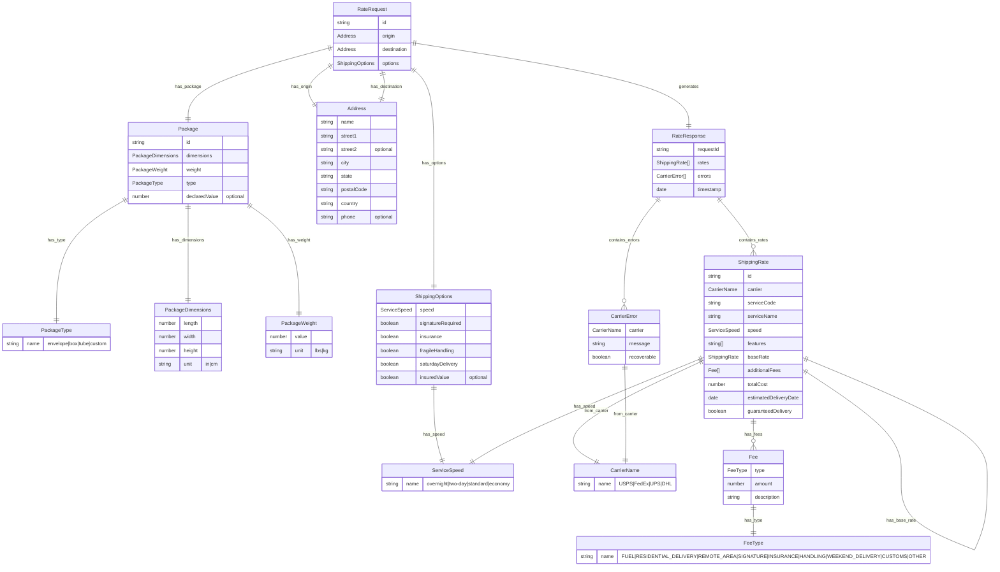

# Shipping Rate Calculator - Architecture Documentation

## System Architecture Diagram

```mermaid
erDiagram
    %% ========== Package Entities ==========
    Package {
        string id
        PackageDimensions dimensions
        PackageWeight weight
        PackageType type
        number declaredValue "optional"
    }
    
    PackageType {
        string name "envelope|box|tube|custom"
    }

    PackageDimensions {
        number length
        number width  
        number height
        string unit "in|cm"
    }
    
    PackageWeight {
        number value
        string unit "lbs|kg"
    }
    
    %% ========== Address Entity ==========
    Address {
        string name
        string street1
        string street2 "optional"
        string city
        string state
        string postalCode
        string country
        string phone "optional"
    }
    
    %% ========== Shipping Options ==========
    ServiceSpeed {
        string name "overnight|two-day|standard|economy"
    }

    ShippingOptions {
        ServiceSpeed speed
        boolean signatureRequired
        boolean insurance
        boolean fragileHandling
        boolean saturdayDelivery
        boolean insuredValue "optional"
    }
    
    %% ========== Carrier Entities ==========
    CarrierName {
        string name "USPS|FedEx|UPS|DHL"
    }
    
    ShippingRate {
        string id
        CarrierName carrier
        string serviceCode
        string serviceName
        ServiceSpeed speed
        string[] features
        ShippingRate baseRate
        Fee[] additionalFees
        number totalCost
        date estimatedDeliveryDate
        boolean guaranteedDelivery
    }
    
    Fee {
        FeeType type
        number amount
        string description
    }

    FeeType {
        string name "FUEL|RESIDENTIAL_DELIVERY|REMOTE_AREA|SIGNATURE|INSURANCE|HANDLING|WEEKEND_DELIVERY|CUSTOMS|OTHER"
    }
    
    %% ========== Request/Response Entities ==========
    RateRequest {
        string id
        Address origin
        Address destination
        ShippingOptions options
    }
    
    RateResponse {
        string requestId
        ShippingRate[] rates
        CarrierError[] errors
        date timestamp
    }
    
    CarrierError {
        CarrierName carrier
        string message
        boolean recoverable
    }
    
    %% ========== RELATIONSHIPS ==========
    %% Package relationships
    Package ||--|| PackageType : "has_type"
    Package ||--|| PackageDimensions : "has_dimensions"
    Package ||--|| PackageWeight : "has_weight"
    
    %% ShippingOptions relationships
    ShippingOptions ||--|| ServiceSpeed : "has_speed"
    
    %% RateRequest relationships
    RateRequest ||--|| Package : "has_package"
    RateRequest ||--|| Address : "has_origin"
    RateRequest ||--|| Address : "has_destination"
    RateRequest ||--|| ShippingOptions : "has_options"
    
    %% RateResponse relationships
    RateResponse ||--o{ ShippingRate : "contains_rates"
    RateResponse ||--o{ CarrierError : "contains_errors"
    
    %% ShippingRate relationships
    ShippingRate ||--|| CarrierName : "from_carrier"
    ShippingRate ||--|| ServiceSpeed : "has_speed"
    ShippingRate ||--o{ Fee : "has_fees"
    
    %% Fee relationships
    Fee ||--|| FeeType : "has_type"
    
    %% CarrierError relationships
    CarrierError ||--|| CarrierName : "from_carrier"
    
    %% RateRequest -> RateResponse relationship
    RateRequest ||--|| RateResponse : "generates"
    
    %% NOTE: ShippingRate.baseRate is a self-reference (recursive)
    ShippingRate ||--|| ShippingRate : "has_base_rate"
```